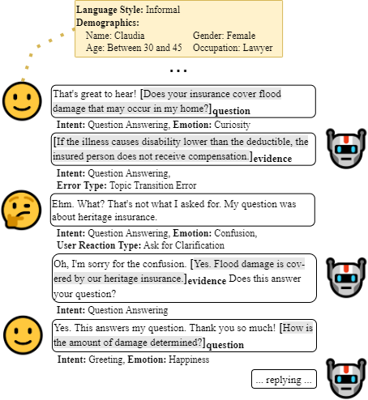
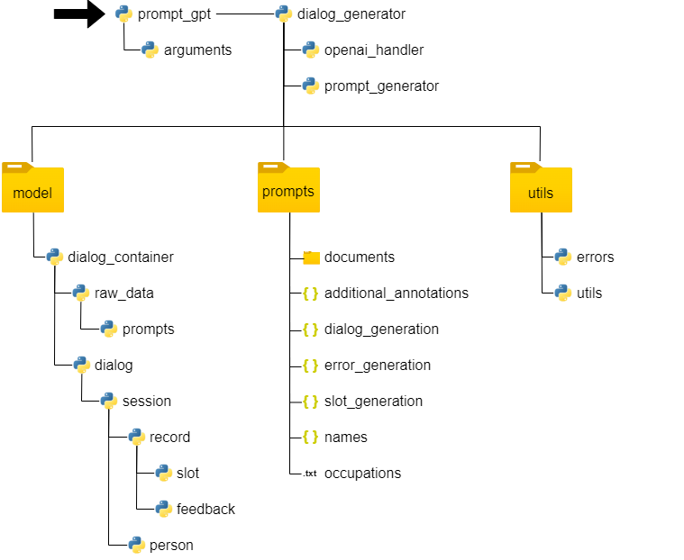

# Learning from Implicit User Feedback, Emotions and Demographic Information in Task-Oriented and Document-Grounded Dialogues

In this repository, we provide the generation framework and example scripts for using the FEDI data. FEDI is the first task-oriented document-grounded dialogue dataset for learning from demographic information, user emotions and implicit user feedback. In its current version, FEDI consists of 8,852 dialogues, divided into 1,988 feedback-free dialogues, including 326 test dialogues, and 6,864 feedback dialogues (1,716 in four versions, each with one feedback scneario less per dialogue). The dataset itself is available [here](https://tudatalib.ulb.tu-darmstadt.de/handle/tudatalib/4181).

<p align="center">

</p>

## Dataset Description
FEDI covers four use cases for task-oriented document-grounded dialogue systems from three domains:

- __Post Office Services:__ For post office services, FEDI includes (1) customer support for parcel shipping, i.e., guiding them through the process of parcel shipping from choosing the right shipping box to informing them about the approximate delivery time, and (2) topping up a prepaid SIM card. Following are the slot values for this task:
  - Parcel Shipping:
    - Destination (informable) -- The city and country of destination; national or international.
    - Weight (informable) -- The weight of the item to be shipped, lightweight (up to 5kg), average (up to 20kg), heavy (up to 30kg).
    - Package required (informable) -- Whether or not a new shipping box is required.
    - Delivery option (informable) -- Express or standard delivery.
    - Country of destination (informable) -- The destination country.
    - Shipping box name (requestable) -- Name of the best suitable shipping box (small-sized, medium-sized, large-sized), based on the weight of the item to be sent.
    - Shipping box description (requestable) -- Brief description on why the suggested shipping box is the best option.
    - Shipping procedure (requestable) -- Description of the shipping procedure (e.g., take the box to the counter...).
    - Shipping time (requestable) -- Expected delivery time, one to three days for national, four to six days for european, and 3-4 weeks for international deliveries.
  - Top Up SIM Card:
    - Phone number (informable) -- Table or mobile phone number with country code.
    - Phone provider (informable) -- The prone provider, e.g., Vodafone, POSTE Mobile, ...
    - Import payment (informable) The recharge amount, e.g., 10 euro, 20 euro, 30 euro.
    - Outcome operation (requestable) -- If all required information were provided, the system asks the user to insert the card for payment.
  -  Request Ticket:
      - Type of service (informable) -- The type of service for which the user wants to request support, i.e., parcel shipping or topping up a prepaid SIM card.
      - Ticket number (requestable) -- The ticket number generated for the request.
- __Receptionist Service:__ As receptionist service, FEDI includes access control, i.e., the reception and registration of new visitors in office buildings. Following are the slot values:
  - Guest name (informable) -- The name of the person who wants to access the building.
  - Host name (informable) -- The name of the person the guest wants to visit.
  - Host e-mail (informable) -- The e-mail address of the host.
  - Alternative host name (informable) -- An alternative host, e.g., in case the host is not available.
  - Alternative host e-mail (informable) -- E-mail address of the alternative host.
  - Meeting date and time (informable) -- Date and time of the appointment.
  - Meeting room identifier (informable) -- Unique identifier of the room where the meeting will take place.
  - Verification call (requestable) -- The system can set up a verification call to let the host visually inspect the guest and authorize access.
  - Confirmation to open turnstile (requestable) -- This is a signal to the system that controls the turnstile to let the guest enter.
  - Add. safety information (requestable) -- Any additional safety information, e.g., related to Covid-19.
- __Customer Service in the Insurance Domain:__ As customer service in the insurance domain, FEDI includes question answering in the context of financial topics and pet, health and heritage insurance. These dialogues additionally provide document annotations. Following are the slot values:
  - Question (informable) -- A question to one of the topics.
  - Type of bills (informable) -- If the user asks a question regarding a specific payment slip, they need to provide the type.
  - Evidence (requestable) -- The answer to the user's question.
  - Bill form description (requestable) -- Description of the specific payment form (if the question was about a payment form).
  - Bill form name (requestable) -- Name of the payment form (if the question was about a payment form).
  - Bill form paymend procedure (requestable) -- Information on how to fill the payment form (if the question was about a payment form).

We provide more details on the task descriptions in Appendix A of our paper.
### Problem formulation
We define a dialogue as a set of multiple turns $T$. Each turn consists of two utterances, a user utterance $U_t$ and a system utterance $S_t$. Given the dialogue context $C=[T_0, ..., T_{t-1}]$, and additional information $K$, the task is to predict the user intent $I_t$, generate belief state $B_t$ and system utterance $S_t$:

$(I_t, B_t, S_t) = \text{generate}(K, C, U_t)$

Depending on whether knowledge from a document $D_t$ is required to generate $S_t$ or the user emotion $E_t$, demographic information $DI$, generation error $GE_t$, or implicit user feedback  $F_t$ should be considered, $K=\{D_t, DI, E_t, GE_t, F_t\}$. $DI$ includes the user's gender, age range, occupation, name, and language style. Belief state $B_t$ includes the slot values inferred from the dialogue context $C$.

### Dataset Structure
We provide FEDI in the _dataset_ folder of this repository. It contains the dialogues in a format ready for training and inference. Each dialogue file contains a list of samples generated from the original dialogue. As introduced in the paper, we further distinguish between _feedback-free_ and _feedback_ dialogues. The _feedback_ dialogues are organized in _stages_ (_version_ in the paper). Following is the structure of the data:

```json
[
    {
        "target": "<the target system utterance>",
        "context": "<the preceding dialogue context>",
        "documents": ["<a list of documents relevant to predict the target system utterance>"
        ],
        "intent": "<the target intent>",
        "slots": "<the target slot values (belief state)>",        
        "emotion": "<the user emotion>",        
        "user_persona": "<the demographic information>"
    },
    ...
]
```
The feedback dialogues additionally contain the feedback annotations. Another difference is that they do not provide a list of samples per file, but only one sample per file. The _test_ data in the _feedback-free_ folder are also the test data for the feedback dialogues.

### Example Scripts

We will provide our scripts for using the data as soon as we have unified and cleaned them up. In the problem formulation, we have already described how we use the data and the dataset and dialog structure has also already been explained. It should therefore already be possible to reuse the data.

## Dialogue and Annotation Generation Framework
We provide our code for dialogue generation and annotation in the _dialogue-generation_ folder. We provide a detailed description of the steps involved in the paper. To run it, please install the packages from our _requirements.txt_ and the _dialogue-generation_ folder itself first. We used Python 3.10 for dialogue generation. The following figure gives an overview of the folder structure and dependencies:

<p align="center">

</p>

_prompt_gpt.py_ is the starting script. It initializes dialogue generation according to the arguments passed in the command line and creates a _dialog_generator_ object. This object in turn initializes a session with the OpenAI API and manages the dialog generation process. The dialogs, their annotations, generated prompts and the responses from OpenAI are represented by objects from the classes in the _model_ folder. _prompts_ includes all the hard-coded instructions and additional data, such as names, occupations, and the documents (in txt files). Prompts are generated by the _prompt_generator_ object. _utils_ contains error classes and utility functions (such as for data cleansing).

To run the framework, you have to call _prompt_gpt.py_ using the the following command:

```bash
python prompt_chatgpt.py \
    --apipath <path to your openai api key> \
    --retries <number of retries> \
    --dialogs <number of dialogs> \
    --tasks  <task> \
    --output_dir <directory for finished dialogs> \
    --config_prompts prompt_config.yml
```

For question answering, you have to add the _topic_ argument to the list (e.g., `--topic finance`, with finance as document directory from _prompt_config.yml_). For feedback dialogue generation, you have to add the _errors_ argument, e.g., `--errors 3` to generate a dialogue with three feedback situations. We describe all arguments in _argument.py_.

## Citation

Please reference our work as follows:

```
@inproceedings{
  anonymous2024learning,
  title={Learning from Implicit User Feedback, Emotions and Demographic Information in Task-Oriented Document-Grounded Dialogues},
  author={Anonymous},
  booktitle={The 2024 Conference on Empirical Methods in Natural Language Processing},
  year={2024},
  url={https://openreview.net/forum?id=WAkSqdL3f2}
}
```

## Contact Persons

Dominic Petrak (<petrak@ukp.informatik.tu-darmstadt.de>)
  
## Links

[UKP Lab Homepage](https://www.ukp.tu-darmstadt.de/) | [TU Darmstadt Website](https://www.tu-darmstadt.de/index.en.jsp)
